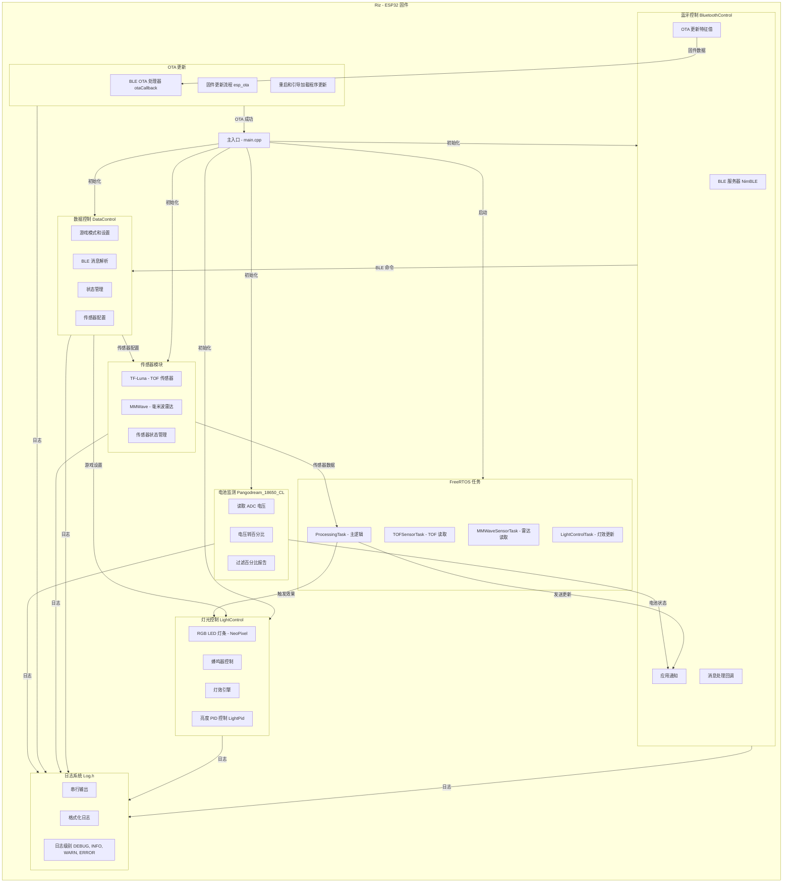

# Riz - ESP32 固件技术详情

**当前版本:** v0.0.2
**最后更新:** 2025-12-06
**开发平台:** ESP32 (ESP-IDF / Arduino Framework)

本项目为 **Riz** 设备实现固件，使用 ESP32 平台。集成了多个子系统，包括：
- **蓝牙控制** (支持 OTA 更新)
- **灯光控制**
- **数据控制** (游戏模式设置)
- **传感器模块** (TOF 激光测距传感器和毫米波雷达传感器)
- **电池监测** 和基于 FreeRTOS 的**任务管理**

以下是 Riz 的系统架构概览：



---

## 简介

本固件为 **Riz** 设备打造，提供强大的控制和传感器处理能力，用于交互式应用。它充分利用 ESP32 的双核能力并发运行任务：
- **核心 0** 主要处理高级逻辑（例如，处理传感器事件和控制游戏模式）
- **核心 1** 专门用于时间关键的传感器任务，包括处理来自 TF-Luna TOF 传感器和雷达传感器的数据

---

## 快速开始

### 环境要求

- **硬件:** ESP32 开发板、TF-Luna TOF 传感器（或等效产品）、LED 组件和其他传感器模块
- **软件:**
  - [ESP-IDF](https://docs.espressif.com/projects/esp-idf/en/latest/esp32/get-started/) 或为 ESP32 开发配置的 Arduino IDE
  - BLE、FreeRTOS、传感器接口等所需库

### 硬件设置

- **I2C 连接:**
  查看 [`include/Global_VAR.h`](include/Global_VAR.h) 了解 I2C 引脚定义
  > **注意:** 如有必要，这些引脚可以重新配置为其他协议（如 TX/RX）
- **传感器接线:**
  通过 I2C 连接 TF-Luna 传感器，并确保适当的电源调节

### 软件设置

1. **克隆仓库:**
   ```bash
   git clone https://github.com/KleanOcean/YoachRiz-EmbeddedSystem.git
   cd YoachRiz-EmbeddedSystem/RizEmbededSystem
   ```

2. **配置和编译:**
   - **使用 PlatformIO (推荐):**
     ```bash
     pio run -e esp32doit-devkit-v1
     pio run -t upload -e esp32doit-devkit-v1
     pio device monitor -b 921600
     ```
   - **使用 ESP-IDF:**
     ```bash
     idf.py build
     idf.py flash
     idf.py monitor
     ```
   - **使用 Arduino IDE:**
     打开项目，选择正确的 ESP32 开发板，然后编译/上传

### 运行和测试

- 烧录后，固件会初始化并配置所有子系统
- **游戏模式:**
  固件支持多种游戏模式。在 **手动模式 (MANUAL_MODE)** 中，TF-Luna 传感器首先采集基线，然后 LED 点亮，开始对象检测
- 使用 BLE 客户端或串行监视器查看日志并与设备交互

---

## 项目结构

```
RizEmbededSystem/
├── src/                          # 源代码
│   ├── main.cpp                  # 主入口、任务创建和系统初始化 (812 行)
│   ├── LightControl.cpp          # LED 灯效控制 (945 行)
│   ├── BluetoothControl.cpp      # BLE 通信协议 (151 行)
│   ├── DataControl.cpp           # 数据和状态管理 (178 行)
│   ├── TF_Luna_UART.cpp          # TOF 传感器驱动 (676 行)
│   ├── MMWave.cpp                # 毫米波雷达驱动 (703 行)
│   ├── OTA.cpp                   # OTA 更新处理 (185 行)
│   ├── Pangodream_18650_CL.cpp   # 电池监测 (337 行)
│   ├── LightPid.cpp              # PID 亮度控制
│   └── Log.cpp                   # 日志系统实现
│
├── include/                      # 头文件
│   ├── Global_VAR.h              # 全局变量、常量和引脚定义
│   ├── BluetoothControl.h        # BLE 接口
│   ├── LightControl.h            # LED 控制接口
│   ├── DataControl.h             # 数据管理接口
│   ├── TF_Luna_UART.h            # TOF 驱动接口
│   ├── MMWave.h                  # 毫米波雷达接口
│   ├── OTA.h                     # OTA 更新接口
│   ├── Pangodream_18650_CL.h     # 电池监测接口
│   ├── LightPid.h                # PID 控制接口
│   └── Log.h                     # 日志系统接口
│
├── lib/                          # 自定义库
│   └── YMOTOR/                   # 电机控制库（保留）
│
├── docs/                         # 完整文档体系
│   ├── README.md                 # 文档导航首页
│   ├── 架构设计/
│   │   ├── 系统架构.md           # 分层架构、FSM、并发模型
│   │   ├── 硬件接口.md           # 引脚定义、电源管理
│   │   └── 功能说明.md           # 游戏模式详细说明
│   ├── 通信协议/
│   │   ├── BLE通信协议.md        # GATT 服务、命令格式
│   │   ├── BLE_API参考.md        # API 端点、回调函数
│   │   └── 快速参考.md           # 游戏模式速查表
│   ├── 开发指南/
│   │   ├── 模块开发参考.md       # 模块技术深入分析
│   │   ├── 实施指南.md           # 开发和调试步骤
│   │   └── PRD编写规范.md        # 产品需求文档模板
│   ├── 传感器/
│   │   ├── TOF传感器完整指南.md  # 问题排查和解决方案
│   │   └── 毫米波雷达技术文档.md # 配置和使用
│   └── 维护记录/
│       └── 关键Bug修复.md        # Bug 分析和修复记录
│
├── ota_updates/                  # OTA 固件更新系统
│   ├── src/
│   │   ├── ota_gui.py            # Python GUI 更新工具
│   │   ├── ble_manager.py        # BLE 设备管理
│   │   ├── firmware_compiler.py  # 固件编译集成
│   │   └── ota_uploader.py       # 固件上传器
│   ├── docs/                     # OTA 实现文档
│   └── requirements.txt          # Python 依赖
│
├── RizSimulator/                 # Python 模拟器和测试工具
│   ├── src/
│   │   ├── main.py               # 模拟器主程序
│   │   ├── device_core.py        # 设备核心逻辑
│   │   ├── gui/                  # PyQt6 图形界面
│   │   └── widgets/              # 自定义组件
│   ├── docs/                     # 模拟器文档
│   └── requirements.txt          # Python 依赖
│
├── test/                         # 测试文件
├── platformio.ini                # PlatformIO 配置
├── BluetoothProtocol.md          # BLE 通信协议规范
├── v0_1_0_upgrade_plan.md        # v0.1.0 升级计划
└── README.md                     # 本文件
```

---

## 详细文档

有关项目特定方面的更深入信息，请参阅 `docs/` 目录中的文档。主要文档包括：

### 📚 核心文档

- **[`docs/README.md`](docs/README.md)**: 提供概览和所有其他文档文件的链接

### 🏗️ 架构设计
- [`docs/架构设计/系统架构.md`](docs/架构设计/系统架构.md): 高级系统设计、分层架构、FSM 状态机
- [`docs/架构设计/功能说明.md`](docs/架构设计/功能说明.md): 用户模式和功能描述
- [`docs/架构设计/硬件接口.md`](docs/架构设计/硬件接口.md): 引脚定义和硬件细节

### 📡 通信协议
- [`docs/通信协议/BLE通信协议.md`](docs/通信协议/BLE通信协议.md): BLE 通信协议完整规范
- [`docs/通信协议/BLE_API参考.md`](docs/通信协议/BLE_API参考.md): BLE API 端点和回调
- [`docs/通信协议/快速参考.md`](docs/通信协议/快速参考.md): 游戏模式速查表

### 🛠️ 开发指南
- [`docs/开发指南/模块开发参考.md`](docs/开发指南/模块开发参考.md): 软件模块技术细节
- [`docs/开发指南/实施指南.md`](docs/开发指南/实施指南.md): 开发和调试步骤
- [`docs/开发指南/PRD编写规范.md`](docs/开发指南/PRD编写规范.md): 产品需求文档模板

### 🔬 传感器文档
- [`docs/传感器/TOF传感器完整指南.md`](docs/传感器/TOF传感器完整指南.md): TOF 传感器问题排查和解决方案
- [`docs/传感器/毫米波雷达技术文档.md`](docs/传感器/毫米波雷达技术文档.md): MMWave 雷达配置和使用

### 📋 产品需求
- [`docs/PRD_Window_Mode.md`](docs/PRD_Window_Mode.md): Window Mode 产品需求文档（即将推出的功能）
- [`docs/PRD_TIMED_MODE_Fix.md`](docs/PRD_TIMED_MODE_Fix.md): Timed Mode 修复需求

### 🔧 维护记录
- [`docs/维护记录/关键Bug修复.md`](docs/维护记录/关键Bug修复.md): Bug 分析和修复记录

---

## 核心功能

### 🎮 六大游戏模式

| 模式 ID | 模式名称 | 说明 | 使用传感器 |
|---------|---------|------|-----------|
| 1 | 手动模式 (Manual) | 用户手动触发检测 | TOF |
| 2 | 随机模式 (Random) | 随机计时触发 | TOF |
| 3 | 计时模式 (Timed) | 固定时间间隔 | MMWave |
| 4 | 双击模式 (Double) | 连续双击计数 | TOF |
| 5 | 节奏模式 (Rhythm) | 自定义 RGB 色彩 + 计时 | 可选 |
| 6 | 运动模式 (Movement) | 运动检测追踪 | MMWave |

### 📡 双传感器系统

#### TOF 激光测距传感器 (TF-Luna)
- UART 通信 (921600 波特率)
- 距离范围: 0.2m - 8m
- 动态基线学习算法
- 自适应幅度阈值检测
- 运动平均滤波 + 防抖动
- 冷却期处理

#### MMWave 毫米波雷达 (计划中)
- 目标检测和距离测量
- 信号强度评估
- 异步检测任务

### 💡 RGB 灯效系统

- **48 颗 NeoPixel RGB LED 灯珠** (GPIO 23)
- 支持多种动态效果:
  - 扫光效果 (Wipe)
  - 渐变动画
  - 倒计时进度显示
  - 呼吸灯效果
- **PID 亮度控制**
- **16 种预设颜色**
- 非阻塞动画引擎

### 🔊 声音反馈

- 蜂鸣器音效提示 (GPIO 4)
- 可配置音调和时长
- 非阻塞 PWM 控制

### 📱 蓝牙通信

- **BLE 4.2** 低功耗蓝牙 (NimBLE 协议栈)
- GATT 服务和特征值
- 实时命令接收和状态通知
- 支持移动应用控制
- OTA 固件更新支持

### 🔋 电源管理

- 18650 锂电池支持
- ADC 电压监测 (GPIO 35)
- 电量百分比计算
- 移动平均滤波
- 低电量警告

---

## 技术特性

### ⚡ 性能指标

| 指标 | 数值 |
|------|------|
| CPU 频率 | 240 MHz (双核 Xtensa LX6) |
| RAM | 512 KB (可用约 350 KB) |
| Flash | 4 MB |
| BLE 吞吐量 | ~20 KB/s |
| TOF 采样率 | 100 Hz |
| LED 刷新率 | 60 FPS |
| 任务响应时间 | < 10 ms |
| OTA 更新时间 | ~2-3 分钟 |

### 🔧 开发工具

#### OTA 固件更新工具
```bash
cd ota_updates
pip install -r requirements.txt
python src/ota_gui.py
```

**功能:**
- 自动编译固件 (集成 PlatformIO)
- BLE 设备扫描和连接
- 进度显示和错误处理
- 支持多设备批量更新 (计划中)

#### RizSimulator 模拟器
```bash
cd RizSimulator
pip install -r requirements.txt
python src/main.py
```

**功能:**
- 完整的设备行为模拟
- PyQt6 图形界面
- BLE 服务器模拟
- 传感器和 LED 可视化
- 多设备并行测试

---

## 版本历史

### v0.0.2 (2025-12-06)

**新功能:**
- ✅ **Window Mode PRD**: 为 Window Mode 训练添加了全面的产品需求文档
- ✅ **iPad 集成**: 优化了 iPad mini 显示的 UI 布局和间距
- ✅ **Config View**: 将滑块转换为水平布局，以获得更好的 iPad 体验
- ✅ **文档**: 增强的项目文档结构，包含完整的中英文文档

### v0.0.1 (初始版本)

**核心功能:**
- ✅ 支持多模式的核心固件实现
- ✅ BLE 通信和 OTA 更新
- ✅ TOF 和 MMWave 传感器集成
- ✅ 具有多种灯效的 RGB LED 控制
- ✅ FreeRTOS 任务管理
- ✅ 游戏模式: Manual, Random, Timed, Double, Rhythm, Movement

---

## 升级计划

### v0.1.0 (开发中)

**核心改进:**
- 🔄 **架构重构**: 完整的事件驱动通信
- 🔄 **消除轮询标志**: 使用 RTOS 队列和事件组
- 🔄 **后台任务**: 系统监控、电池管理、深度睡眠
- 🔄 **传感器任务优化**: 事件驱动启动/停止
- 🔄 **改进的日志和诊断系统**

详细升级计划请参阅: [`v0_1_0_upgrade_plan.md`](v0_1_0_upgrade_plan.md)

---

## 贡献

欢迎 Fork 本仓库，提交 Issue 或 Pull Request 来提出改进或修复。

**代码规范:**
- 遵循现有代码风格
- 添加详细注释和日志
- 更新相关文档
- 通过所有测试

---

## 许可证

本项目采用 MIT 许可证 - 详见 LICENSE 文件

---

## 联系方式

**项目维护者:** Yoach Team
**项目主页:** https://github.com/KleanOcean/YoachRiz-EmbeddedSystem
**问题反馈:** [GitHub Issues](https://github.com/KleanOcean/YoachRiz-EmbeddedSystem/issues)

---

## 致谢

感谢以下开源项目的支持:

- [ESP-IDF](https://github.com/espressif/esp-idf) - Espressif IoT 开发框架
- [NimBLE-Arduino](https://github.com/h2zero/NimBLE-Arduino) - 轻量级 BLE 协议栈
- [Adafruit NeoPixel](https://github.com/adafruit/Adafruit_NeoPixel) - LED 灯条控制库
- [PlatformIO](https://platformio.org/) - 跨平台嵌入式开发工具

---

<div align="center">

**用心打造，追求卓越** 🚀

Made with ❤️ by Yoach Team

</div>
