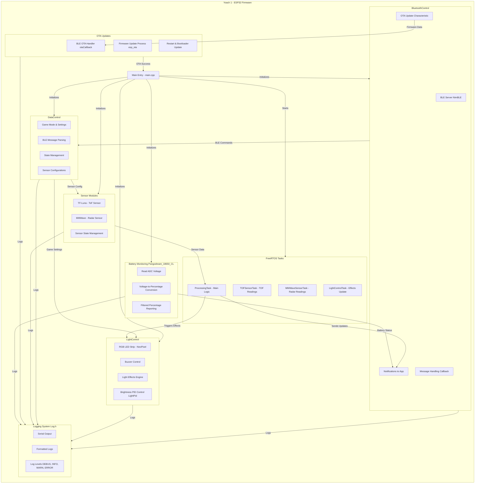

# Yoach 1 - ESP32 Firmware Technical Details

**Current Version:** v0.0.2
**Last Updated:** 2025-12-06
**Platform:** ESP32 (ESP-IDF / Arduino Framework)

This project implements the firmware for the **Yoach 1** device using the ESP32. It integrates multiple subsystems including:
- **Bluetooth Control** (with OTA updates),
- **Light Control**,
- **Data Control** for game mode settings,
- **Sensor Modules** (Time-of-Flight sensor and mmWave sensor),
- **Battery Monitoring** and **Task Management** using FreeRTOS.

Below is the system architecture overview for Yoach 1:




---

## Introduction

This firmware is built for the **Yoach 1** device, providing robust control and sensor processing for interactive use. It leverages the ESP32's dual-core capabilities to run tasks concurrently:
- **Core 0** mainly handles high-level logic (e.g., processing sensor events and controlling game modes).
- **Core 1** is dedicated to time-critical sensor tasks, including processing data from the TF-Luna TOF sensor and Radar sensor.

---

## Getting Started

### Prerequisites
- **Hardware:** ESP32 development board, TF-Luna TOF sensor (or equivalent), LED components, and any other sensor modules.
- **Software:** 
  - [ESP-IDF](https://docs.espressif.com/projects/esp-idf/en/latest/esp32/get-started/) or the Arduino IDE set up for ESP32 development.
  - Required libraries for BLE, FreeRTOS, sensor interfacing, etc.

### Hardware Setup
- **I2C Connections:**  
  Check [`include/Global_VAR.h`](include/Global_VAR.h) for the I2C pin definitions.  
  > **Note:** These pins can be reconfigured for other protocols (like TX/RX) if necessary.
- **Sensor Wiring:**  
  Connect the TF-Luna sensor via I2C and ensure proper power conditioning.

### Software Setup
1. **Clone the Repository:**
   ```bash
   git clone <repository-url>
   cd <repository-directory>
   ```
2. **Configure and Build:**
   - **Using ESP-IDF:**
     ```bash
     idf.py build
     idf.py flash
     idf.py monitor
     ```
   - **Using Arduino IDE:**  
     Open the project, select the correct ESP32 board, and then compile/upload.

### Running and Testing
- Once flashed, the firmware initializes and configures all subsystems.
- **Game Modes:**  
  The firmware supports multiple game modes. In **MANUAL_MODE**, the TF-Luna sensor takes a baseline first, then the LED lights up, and object detection begins.
- Use a BLE client or Serial Monitor to view logs and interact with the device.

---

## Project Structure

- **src/**: Contains:
  - `main.cpp`: Main entry, task creation, and system initialization.
  - Sensor and control tasks.
- **include/**: Contains header files including global variable definitions.
- **README.md:** This document provides an overview and starting guide.

---

## Detailed Documentation

For more in-depth information on specific aspects of the project, please refer to the documentation within the `docs/` directory. Key documents include:

-   **[`docs/README.md`](docs/README.md)**: Provides an overview and links to all other documentation files.
-   [`docs/SYSTEM_ARCHITECTURE.md`](docs/SYSTEM_ARCHITECTURE.md): High-level system design.
-   [`docs/FUNCTIONAL_DESCRIPTION.md`](docs/FUNCTIONAL_DESCRIPTION.md): Description of user modes and features.
-   [`docs/MODULE_REFERENCE.md`](docs/MODULE_REFERENCE.md): Technical details on software modules.
-   [`docs/HARDWARE_INTERFACE.md`](docs/HARDWARE_INTERFACE.md): Pinouts and hardware specifics.
-   [`docs/BLE_API_REFERENCE.md`](docs/BLE_API_REFERENCE.md): BLE communication protocol.
-   [`docs/SYSTEM_PROTOCOL.md`](docs/SYSTEM_PROTOCOL.md): Communication patterns, feedback (BLE/logs), and terminology.
-   [`docs/PRD_Window_Mode.md`](docs/PRD_Window_Mode.md): Product Requirements Document for Window Mode (upcoming feature).

---

## Version History

### v0.0.2 (2025-12-06)
- **Window Mode PRD**: Added comprehensive Product Requirements Document for Window Mode training
- **iPad Integration**: Optimized UI layout and spacing for iPad mini display
- **Config View**: Converted sliders to horizontal layout for better iPad experience
- **Documentation**: Enhanced project documentation structure

### v0.0.1 (Initial Release)
- Core firmware implementation with multi-mode support
- BLE communication and OTA updates
- TOF and MMWave sensor integration
- RGB LED control with multiple light effects
- FreeRTOS task management
- Game modes: Manual, Random, Timed, Double, Rhythm, Movement

---

## Contributing

Feel free to fork and open issues or pull requests if you have improvements or fixes.

---

Happy Coding!