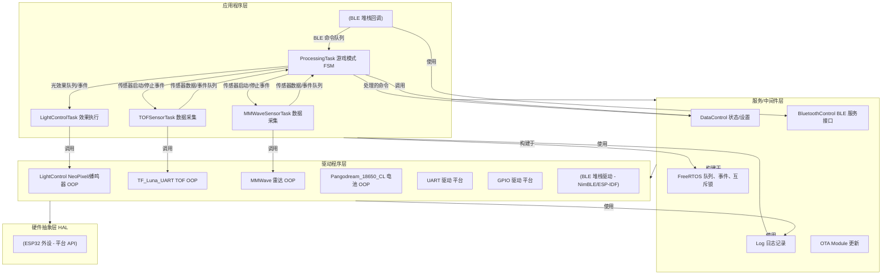

# Yoach 1 - 系统架构

本文档介绍 Yoach 1 设备的高级硬件和软件架构，重点关注指导其开发的设计原则。

## 目录

- [Yoach 1 - 系统架构](#yoach-1---系统架构)
  - [目录](#目录)
  - [1. 硬件概述](#1-硬件概述)
  - [2. 软件概述与架构](#2-软件概述与架构)
    - [2.1 架构原则](#21-架构原则)
    - [2.2 按层分类的软件模块](#22-按层分类的软件模块)
    - [2.3 FreeRTOS 任务结构与交互](#23-freertos-任务结构与交互)
    - [2.4 并发控制与通信](#24-并发控制与通信)
  - [3. 系统架构图](#3-系统架构图)

## 1. 硬件概述

Yoach 1 硬件由以下主要组件组成：

*   **微控制器：** ESP32-WROOM-32-N8 模块（或类似的 ESP32 变体）。提供 Wi-Fi、蓝牙、双核处理和 GPIO 接口。
*   **传感器：**
    *   **TF-Luna：** 飞行时间 (ToF) LiDAR 传感器，通过 UART 连接，用于近距离测距和幅度测量。
    *   **毫米波雷达：** 存在和运动检测雷达传感器，通过 UART 连接。
*   **输出：**
    *   **RGB LED 灯条：** Adafruit NeoPixel 兼容灯条，用于视觉反馈。
    *   **蜂鸣器：** 简单的压电蜂鸣器，用于听觉反馈。
*   **电源：**
    *   通常通过 USB（5V 输入）供电。
    *   板载 3.3V 稳压器。
    *   包括电池监测电路（`Pangodream_18650_CL` 库假设 18650 电池设置）。
    *   需要充足的电源供应（>500mA 峰值）和 ESP32 模块附近的去耦电容。
*   **用户界面：**
    *   复位按钮（连接到 EN 引脚）。
    *   启动按钮（连接到 GPIO0，用于刷写）。
*   **编程/调试：**
    *   USB 转串行芯片（例如 CH340、CP2102），用于固件刷写和通过 USB 端口进行串行日志记录。

## 2. 软件概述与架构

该固件使用 ESP-IDF 框架（在 PlatformIO/Arduino 内）构建，并利用 FreeRTOS 实现多任务处理。它采用混合架构方法，结合了嵌入式系统的多项最佳实践。

### 2.1 架构原则

Yoach 1 固件设计遵循以下原则：

1.  **分层架构：** 软件分为不同的层次（HAL、驱动程序、服务/中间件、应用程序），以促进**关注点分离**。这使系统更易理解、维护和测试。
    *   **HAL（硬件抽象层）：** 由 ESP-IDF/Arduino 核心提供，抽象直接硬件寄存器访问。
    *   **驱动程序：** 封装特定硬件外设的控制逻辑（例如 `LightControl`、`TF_Luna_UART`、`MMWave`）。在适用的地方使用面向对象编程 (OOP)。
    *   **服务/中间件：** 提供应用程序无关的功能，如 BLE 通信（`BluetoothControl`）、状态管理（`DataControl`）、日志记录（`Log`）和 RTOS 原语。
    *   **应用程序：** 包含核心应用逻辑，包括 FreeRTOS 任务和游戏模式状态机（`ProcessingTask`）。
2.  **事件驱动模型：** 任务间通信主要依靠 **FreeRTOS 原语**（队列、事件组），而不是直接共享变量和轮询。这导致：
    *   **非阻塞通信：** 任务有效地等待事件，而不是消耗 CPU 周期轮询标志。
    *   **改进的响应能力：** 系统可以快速响应异步事件，如 BLE 命令或传感器触发。
    *   **解耦：** 任务通过定义良好的消息/事件交互，减少依赖关系。
3.  **有限状态机 (FSM)：** `ProcessingTask` 中的核心游戏逻辑实现为 FSM。这有效地管理不同的操作模式（MANUAL、TIMED、RHYTHM 等）、它们的转换和关联的进入/退出操作，使复杂的模式逻辑保持有序和可预测。
4.  **面向对象编程 (OOP)：** 在适用的地方（主要在驱动程序和服务等 C++ 组件中），使用 OOP 原则将数据和行为封装在类中。这增强了**模块化、可重用性和可维护性**。

**此混合方法的优势：**

*   **可维护性：** 变更局限于特定层或模块。
*   **可扩展性：** 添加新功能（传感器、模式）涉及添加新模块/状态/事件，对其他部分的干扰最小。
*   **响应能力与效率：** 事件驱动设计确保任务仅在需要时运行。
*   **可测试性：** 模块和层可以更独立地进行测试。
*   **可重用性：** 驱动程序和服务可能可在其他项目中重用。
*   **清晰性：** 虽然分散，但每个组件的职责定义明确。

### 2.2 按层分类的软件模块

（详细描述请参考 [`MODULE_REFERENCE.md`](MODULE_REFERENCE.md)）

*   **应用程序层：**
    *   `main.cpp`：初始化、任务创建。
    *   `ProcessingTask`：包含主游戏模式 FSM。
    *   `LightControlTask`：处理非阻塞式光/蜂鸣器效果。
    *   `TOFSensorTask`：管理 TOF 传感器读取循环。
    *   `MMWaveSensorTask`：管理毫米波传感器读取循环。
    *   （BLE 回调在此层处理，通常通过队列委托给 `ProcessingTask`）。
*   **服务/中间件层：**
    *   `DataControl`：中央状态管理，解析 BLE 命令。
    *   `BluetoothControl`：管理 BLE 堆栈交互、命令接收、通知。
    *   `Log`：系统范围的日志工具。
    *   `OTA Module`：处理固件更新。
    *   FreeRTOS：提供核心调度、队列、事件组、互斥锁。
*   **驱动程序层：**
    *   `LightControl`：控制 NeoPixel 灯条和蜂鸣器（OOP）。
    *   `TF_Luna_UART`：与 TOF 传感器交互（OOP）。
    *   `MMWave`：与雷达传感器交互（OOP）。
    *   `Pangodream_18650_CL`：电池监测库（OOP）。
    *   （来自 ESP-IDF/Arduino 的底层 UART、GPIO、BLE 驱动程序）
*   **HAL 层：**
    *   （由 ESP-IDF/Arduino 抽象的 ESP32 外设）

### 2.3 FreeRTOS 任务结构与交互

系统利用多个并发运行的任务，主要通过事件和队列交互：

| 任务名称             | 核心 | 优先级 | 栈 (估计)   | 描述与交互                                                                                                                                                    | 关键模块                      |
| :------------------- | :--- | :------- | :------------ | :-------------------------------------------------------------------------------------------------------------------------------------------------------- | :--------------------------- |
| `ProcessingTask`     | 0    | 2        | ~4KB+         | **游戏模式 FSM 核心。** 等待命令队列（来自 BLE）和传感器事件队列/组。向传感器任务发送启动/停止事件（事件组），向 `LightControlTask` 发送效果请求（队列/事件组）。与 `DataControl` 交互。 | `main`、`DataControl`、RTOS |
| `LightControlTask`   | 0    | 3        | ~2KB          | **效果执行器。** 等待来自 `ProcessingTask` 的效果请求队列/事件组。使用 `LightControl` 驱动程序执行非阻塞式光/蜂鸣器效果。 | `LightControl`、RTOS       |
| `TOFSensorTask`      | 1    | 2        | ~6KB          | **TOF 数据采集。** 等待来自 `ProcessingTask` 的启动事件（事件组）。通过 `TF_Luna_UART` 驱动程序读取传感器。通过队列/事件组将检测事件/数据发送回 `ProcessingTask`。等待停止事件。 | `TF_Luna_UART`、RTOS         |
| `MMWaveSensorTask`   | 1    | 2        | ~4KB          | **雷达数据采集。** 等待来自 `ProcessingTask` 的启动事件（事件组）。通过 `MMWave` 驱动程序读取传感器。通过队列/事件组将检测事件/数据发送回 `ProcessingTask`。等待停止事件。 | `MMWave`、RTOS               |
| （BLE 任务/回调）    | 0    | （默认） | （默认）      | **BLE 通信处理器。** 由 BLE 堆栈管理。接收数据，通过 `BluetoothControl` 服务回调将命令放置在 `ProcessingTask` 命令队列上。发送通知。 | `BluetoothControl`、NimBLE |
| （定时器任务等）     | -    | （默认） | （默认）      | 由 ESP-IDF/Arduino 核心管理的后台系统任务。                                                                                                               | ESP-IDF                    |

### 2.4 并发控制与通信

*   **主要机制：** 任务间通信和同步主要依靠 **FreeRTOS 队列**（用于传递数据，如命令或传感器结果）和**事件组**（用于信号事件，如"启动传感器"、"停止传感器"、"检测发生"）。这促进了非阻塞、解耦的交互。
*   **互斥锁：** 谨慎使用以保护关键部分，其中多个任务*必须*直接原子访问共享资源。这可能适用于 `DataControl` 中的某些状态变量或低级硬件寄存器（如果驱动程序本身不是任务安全的）。之前对简单布尔标志（`has...Task`）的依赖被更强大的事件组替代。

## 3. 系统架构图

---
